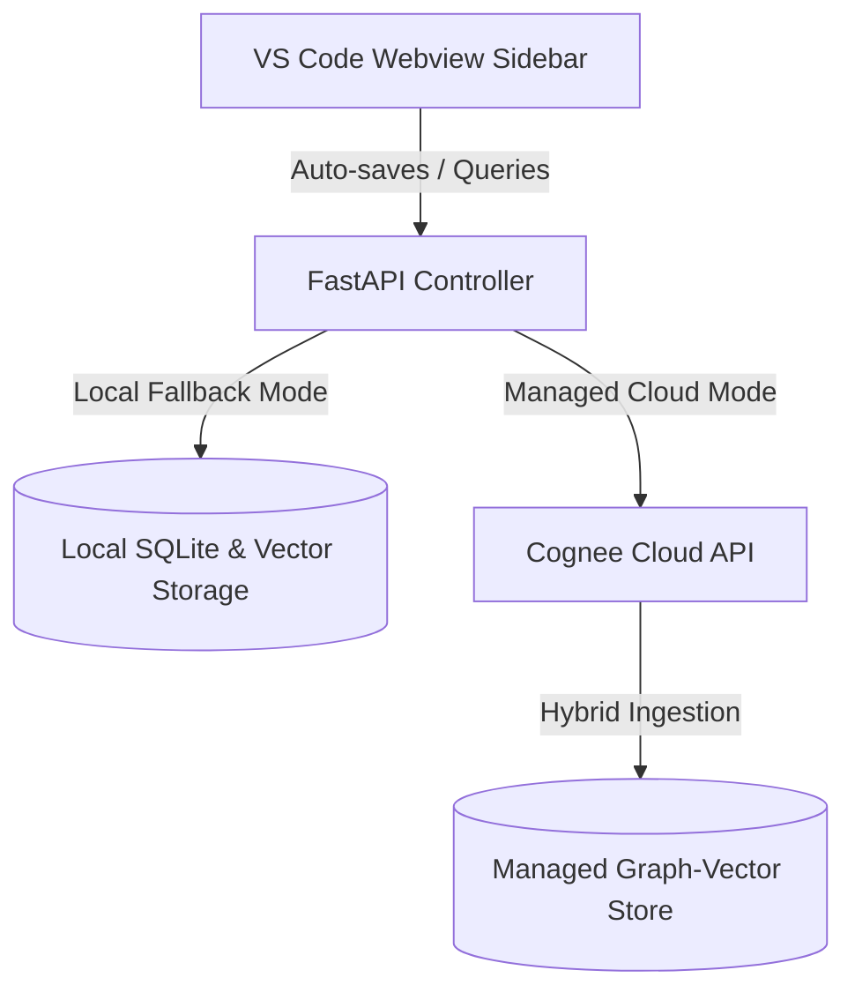

# Align.ai — The Full-Stack Context Guardrail for Developers

> Align.ai is a premium VS Code Extension and FastAPI companion server that prevents layout drift and architectural decay. By leveraging **Cognee's hybrid graph-vector memory layer**, Align.ai watches your workspace in real-time, enforcing strict design system standards (such as Apple-style padding and resolutions) and backend engineering conventions automatically.

---

## 🚀 The Problem & The Solution

### The Problem: Context Drift & Architectural Decay
In modern, fast-paced software development—especially when collaborating with AI assistants—codebases suffer from **context drift**. 
* **UI Inconsistency**: Developers and code-generation models frequently violate design systems, introducing rogue paddings, font declarations, and target resolutions (e.g. drifting from standard Apple-style minimalist guidelines).
* **Architectural Violations**: Naming conventions (PascalCase vs camelCase) are mixed up, and backend structures (like Repository patterns or Controller-Service separations) decay under ad-hoc modifications.
* **Token/Context Overflow**: Developers copy-paste massive files into prompts, leaking sensitive business logic and causing token bloat.

### The Solution: Align.ai
Align.ai acts as a **silent full-stack context watcher** embedded in your IDE.
* **Automated Watcher Hooks**: Intercepts file saves (`.tsx`, `.css`, `.py`, etc.) and automatically ingests modifications into a permanent memory engine.
* **Hybrid Graph-Vector Storage**: Links styling guidelines directly to logic components, building a structured knowledge graph of your repository's conventions.
* **Zero-Drift Prompting**: Dynamically retrieves target guardrails on-demand, generating context-aware prompt payloads to instruct your coding LLM.

---

## 🧠 Cognee Memory Lifecycle Implementation

Align.ai relies on Cognee to manage the codebase knowledge graph. The backend adapter (`memory_engine.py`) exposes three primary APIs:

### 1. `remember(content, dataset_id)` — Code Ingestion
Invoked automatically on file saves. It chunks text, extracts key entities (such as CSS selectors, class architectures), maps relations, and saves them to the dataset.
```python
await cognee.remember(
    text_or_file_content, 
    dataset_id=dataset_name
)
```

### 2. `recall(query_text, datasets)` — Constraint Retrieval
Flashes when the developer requests guardrails or queries conventions. It runs a deep vector search and graph traversal across Cognee to pull historic styling and engineering rules, then structures an LLM-ready prompt.
```python
results = await cognee.recall(
    query_text=query_prompt, 
    datasets=[dataset_name]
)
```

### 3. `forget(dataset_id)` — Surgical Graph Pruning
Purges obsolete design rules, deprecated component memories, or old file references to keep the graph compact and prevent token bloat.
```python
await cognee.datasets.empty_dataset(
    dataset_id=dataset_name
)
```

---

## 🌐 Full-Stack System Architecture



### Managed UX Choice: Zero-Setup Friction
To ensure a **1-click onboarding experience** for evaluators and hackathon judges, Align.ai abstracts local Python dependencies into a secure, managed cloud layer using Cognee Cloud. 
* **Zero Local Dependencies**: End-users do not need to install local graph databases, Python virtual environments, or vector indexers to run the core guardrails.
* **Seamless Fallback**: If no `COGNEE_API_KEY` is provided, the backend falls back to local SQLite and LanceDB storage, letting you run entirely on-premise.

---

## 🎨 Premium Features Overview

| Feature | Scope | Description |
| :--- | :--- | :--- |
| **Sleek Vercel-Style Sidebar** | Frontend (Webview) | Monochromatic, pitch-black dashboard displaying real-time context status, dynamic active file properties, and guardrail settings. |
| **Real-Time Sync Hooks** | Watcher (Extension) | Automatically calls `/remember` when TypeScript, CSS, Python, or JSON files are saved to keep the memory graph up to date. |
| **Dual Guardrail Manager** | Hybrid Spec | Keeps track of both UI/Styling constraints (1280x720 layout, 16px padding) and Engineering logic (Repository pattern, APIException rules). |
| **Dynamic `.cursorrules` Sync** | Extension | Automatically writes the recalled prompt payload into the workspace's `.cursorrules` file. This feeds the retrieved guardrails directly to any coding AI agent (like Cursor or Antigravity) without manual copy-pasting. |
| **Simulated License Hub** | SaaS Demo | Generates credentials instantly via a mock script shell to authorize sandbox developer access. |

---

## 🛠️ Installation & Quick Start

### Prerequisites
* **Node.js** (v18+ or v22+ recommended)
* **Python** (v3.10+)
* **VS Code** (to run the Extension Host)

---

### Step 1: Run the FastAPI Backend Server
1. Navigate to the backend directory:
   ```bash
   cd backend
   ```
2. Set up a virtual environment and activate it:
   ```bash
   python -m venv venv
   # On Windows:
   .\venv\Scripts\activate
   # On macOS/Linux:
   source venv/bin/activate
   ```
3. Install the dependencies:
   ```bash
   pip install -r requirements.txt
   ```
4. Configure your `.env` variables (e.g., provide your `COGNEE_API_KEY` or fallback `OPENAI_API_KEY`).
5. Run the FastAPI server:
   ```bash
   python server.py
   ```
   The backend will start on `http://127.0.0.1:8000`.

---

### Step 2: Compile & Launch the Extension
1. Go back to the root workspace directory:
   ```bash
   cd ..
   ```
2. Install npm dependencies:
   ```bash
   npm install
   ```
3. Compile the TypeScript codebase:
   ```bash
   npm run compile
   ```
4. Open the project in VS Code, and press **`F5`** (or go to **Run and Debug** and click **Launch Extension**).
5. A new VS Code Extension Host window will open. Click the **Align.ai eyeball icon** in the left activity bar to reveal the sidebar panel!

---

## 💡 Commercial Roadmap & SaaS Funnel

```
          ┌────────────────────────────────────────┐
          │        LOCAL DEVELOPER ($0/mo)         │
          │  - Local SQLite & Open-source Graphs   │
          │  - Single-user file-save syncs         │
          └───────────────────┬────────────────────┘
                              │  (Upgrade Funnel)
                              ▼
          ┌────────────────────────────────────────┐
          │       CLOUD ENTERPRISE ($15/mo)        │
          │  - Managed Cognee Cloud Service        │
          │  - Shared Team-wide Design System      │
          │  - Automated Cloud Graph Backups       │
          └────────────────────────────────────────┘
```

* **Local Engine ($0/forever)**: Perfect for solo developers running open-source models locally using local SQLite & Qdrant/LanceDB vector storage.
* **Cloud Enterprise ($15/month)**: Provisioned for team collaboration. Syncs multiple developer workspaces to a shared Cognee Cloud instance, ensuring the entire team stays aligned to the same design tokens and backend repository patterns.

---


